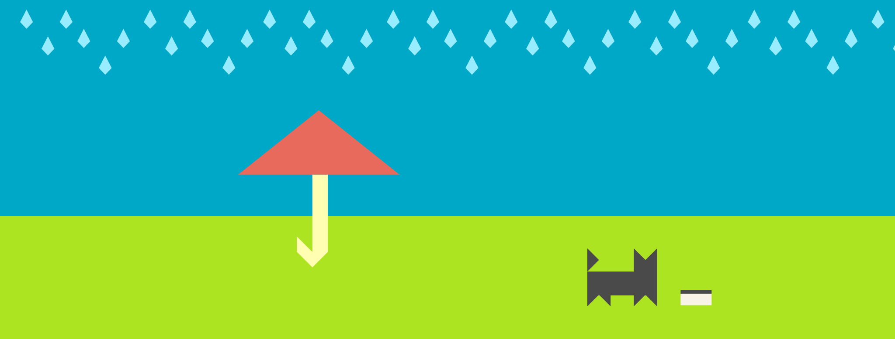

#RainCat - Starting Point
This is the initial code for RainCat, feel free to check it over, then head over to the lesson to get started.

To follow along with the tutorial, check out the article on [Smashing Magazine](https://www.smashingmagazine.com/2016/11/how-to-build-a-spritekit-game-in-swift-3-part-1/).

