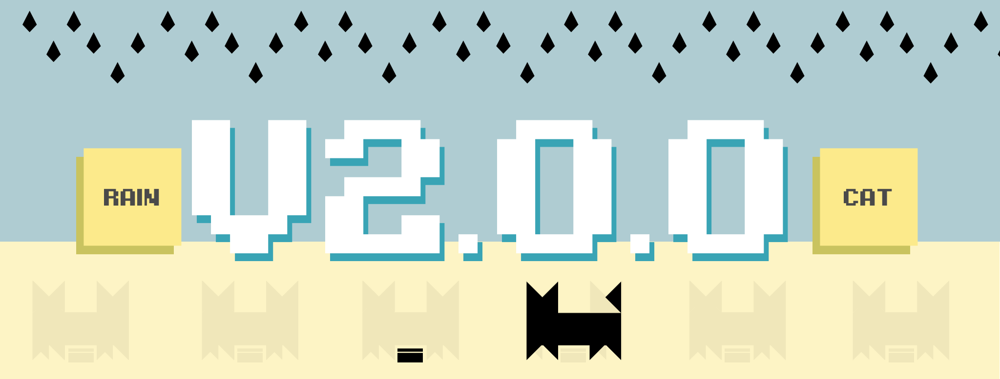

#RainCat

A simple exploration of SpriteKit in Swift 3.

New in version 2.0.0, LCD-cat and Multiplayer classic mode.

Also reworked transitions and menus!

Check out the game in the [AppStore](https://itunes.apple.com/us/app/raincat/id1152624676?ls=1&mt=8)!

Learn to make this game on [Medium](https://medium.com/hello-thirteen23/raincat-lesson-1-79a750ef319f#.2p76gl7ne)!

